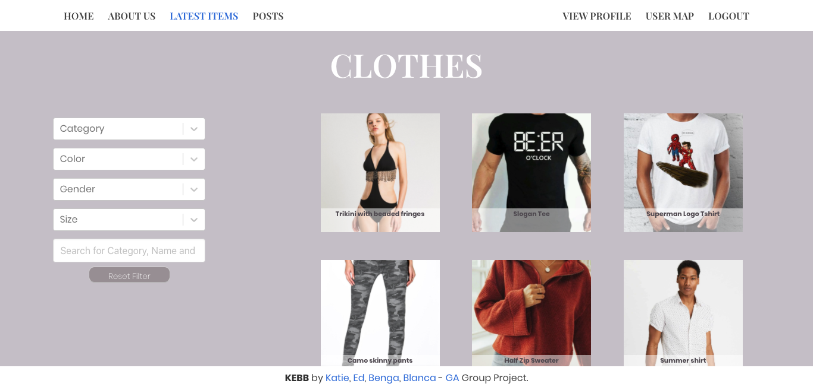

# ** SEI Project three: KEBB Bazaar**

## https://kebb-bazaar-clothes.herokuapp.com/

## **Overview**

Project 3 was my first experience of putting together a *full stack app* as part of a team. We started off by picking a shortlist of ideas which expanded together and then made a group decision on the best option for us. The unanimous decision resulted in **KEBB Bazaar**. From there we created a wireframe using *miro.com*. 

*KEBB Bazaar* is a clothes rental app, inspired by Hurr collective, created in **MERN stack** in 7 days. During the course of this project, I worked in both front and back end development. I thoroughly enjoyed my first official experience in full stack development. 

This app was deployed using **heroku**.

----------------------

## **Brief.**

#### Project brief:

* **Build a full-stack application** by making your own backend and your own front-end
* **Use an Express API** to serve your data from a Mongo database
* **Consume your API with a separate front-end** built with React
* **Be a complete product** which most likely means multiple relationships and CRUD functionality for at least a couple of models
* **Implement thoughtful user stories/wireframes** that are significant enough to help you know which features are core MVP and which you can cut
* **Have a visually impressive design** to kick your portfolio up a notch and have something to wow future clients & employers. **ALLOW** time for this.
* **Be deployed online** so it's publicly accessible.

---------------------

## **Technologies used.**

#### Backend:

* **Node.js**
* **Mongodb**
* **Express**
* Bcrypt
* Body-parser
* Mongoose
* jsonwebtoken

#### Frontend:

* **React**
* Axios
* Bulma
* SCSS
* Http-proxy-middleware
* React Select
* React Router Dom
* React slideshow
* React star rating
* React Map GL
* React notify toast
* React input range

#### Development tools.
* VS code
* Npm/ Nodemon
* Git
* Github
* Google Chrome dev tools
* Eslint linter
* Heroku
* Trello Board
* Miro Board
* Google Drive 

--------------------

## **Approach.**

At the beginning of the project we split our team of four into two pairs. My colleague and I took the back end. Once completed we moved onto the front end to help bring the controllers we had created to life. 

### Back End.

#### Models:

A crucial part of the *KEBB* backend was our models. We created 4 main Schemas using **Mongoose**. We utilized *Mongoose's* capabilities to provide each schema with either **Embedded Schemas** or **Virtual Schema properties** to build complex schemas that supply the front end with comprehensive **APIs**. 

The most *complex schema* was the user schema. We wanted to focus on the user experience in our app, so we tried to include as much functionality to the user schema as possible. We nested several sub-schemas onto the main schema for the map pins, ratings and comments. I created 3 arrays referencing other schemas to create a *favourites* feature for friends, posts and clothing. I also created two **virtuals** to make a collection of any posts or clothing added by the user and one virtual to create a password confirmation field to help validate the password on registration. 

Using **mongoose** and **bcrypt** we manipulated incoming authorization requests to allow us to run prevalidation comparisons and encryption. We also transformed the *JSON* response to prevent the email address and password being included in the response back to the client. 

#### Controllers:

We started off with basic functions to handle simple **CRUD** requests on the clothing and authorization so that our colleagues focusing on the front end could begin building React components. For the *login* function we used the *JSON web token* dependency to create a user token so that we could ensure secure functionality on other aspects of the app. 

My partner and I worked together to console log our way through creating our private messages controllers, as it was a slightly more complex concept than other controllers we had previously built. We decided to try creating an initial message to generate an *id* that we could then build an array of responses on. We used the id of the *current user* and the *target user* to ensure that they were the only two users authorized to see the messages. 

Originally we created a separate functions for inbox and outbox get requests, however, when attempting to use it on the front end I realised that it would be more efficient to concatenate the two together so that the front end could display combined chats. 

Once the backend had hit MVP point we moved onto the front end, however, there were a few points I had to return back to create a new function to accomplish something that I was trying to achieve on the front end. One of those occasions I created a delete user account function. Initially I thought it would be a relatively simple function to build, I quickly realised whilst testing on the front end that it wasn't as simple as I had originally thought. It dawned on me after causing an error that I needed to not only delete the user profile but the entire trace of the user. I achieved this by using a *secure route* to ascertain the user's token then search anything that the user has created on different schemas. I then used a **forEach** statement to cycle through each search and delete the relevant information.

Another key aspect of controllers that I undertook was the testing of all controller functions. I did two stages of testing. Firstly, I performed an initial test to ensure the controller is working efficiently. Secondly, I went through adding specific error handling to improve our JSON responses for front error handling. In the above screenshots I used consistent comments to signify that both checks had been completed. This was helpful for the rest of the team on the front end as they could check if the functions had been tested yet if they were having issues with the responses.

---------------------

### Front End.

By the time we had finished back end, a fair amount of work had been done on front end. This was my first proper developer moment coming into a situation where I was confronted by a bunch of code I hadn't written and had to adapt and catch up. It was a great opportunity to help my team mates, who were more familiar with the front end code, to diagnose and resolve issues. There were occasions where my teammates no longer wanted to work on a certain area of the app and I took over, this was eye opening because I would have to deal with half written code that I wasn't acquainted with. 

#### Comments:

One of the first things I did when I moved onto the front end was to start building comments functions on users and clothes. I did this by adding a new *component* to the common components folder so that i could reuse in various places. I then proceeded to use **Axios** to send *CRUD* requests. Finally I used my **React** to build functions to handle changes in inputs and send axios requests. This was done by using React's **onChange** and **onSubmit** facility to set the state then sent snippets from the state to the backend. 

#### Posts: 

Similar to the processes used in the above section, I used **Axios** and the **RESTful** routes on the backend and built a functioning posts section. Starting with index and show pages at first then moving onto create, update and delete. 

#### Troubleshooting and finishing touches:

A lot of the stuff I have done on the front end has been centered around troubleshooting, error handling and testing then mending any issues I have found. I used **React notify toast** to add toast responses where necessary to update the user with a visual response. I had a to-do list that I added to if I was in the middle of a specific task so that I could return to it later.

-------------------------

## **Bugs.**

At this point, after considerable amount of testing and trying to cause errors to measure the response, I haven't noticed any bugs in the deployed app. I am however aware of an issue of returning the state back to an empty string on submission of a private message.

-------------------------

## **Wins and Issues.**

#### Wins:

This project was a rollercoaster of frustration and elation. There were a few moments of huge relief when resolving issues, both on my own and as a team.

As I mentioned in the backend section above, while working between front and back end I created a full account delete function that removed all traces of a user to prevent causing errors in any posts they have created. This function was far trickier than any of the basic RESTful actions we have learnt and it has been fun console logging my way through and very satisfying when the idea was fully functional. 

The biggest win overall was the successful collaboration in a team of big personalities in a time pressured environment. It was a very positive first experience of coding in a group larger than a pair.

#### Hurdles: 

Looking back over previous projects the hurdles now seem less daunting. Most of the hurdles I encountered were fiddly little bits which I resolved. There are no particular hurdles that standout.

As a team we experienced several issues with *github*. We agreed at the beginning to come together every time we were due a push to the development branch to handle merge clashes as a team. 

Another hurdle we faced as a team was styling in **SCSS** with **Bulma** present. Bulma is a brilliant tool to aid structure, but it proved problematic to deviate from when you want to add some personalised style.

---------------------

## **Screenshots of project**

